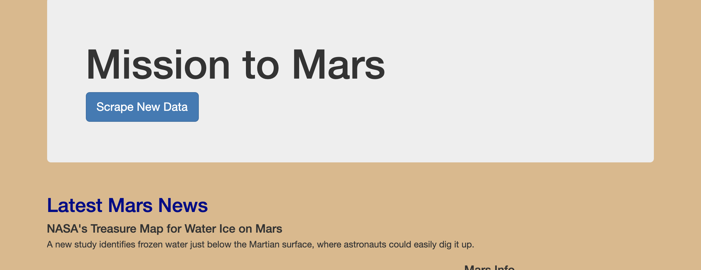
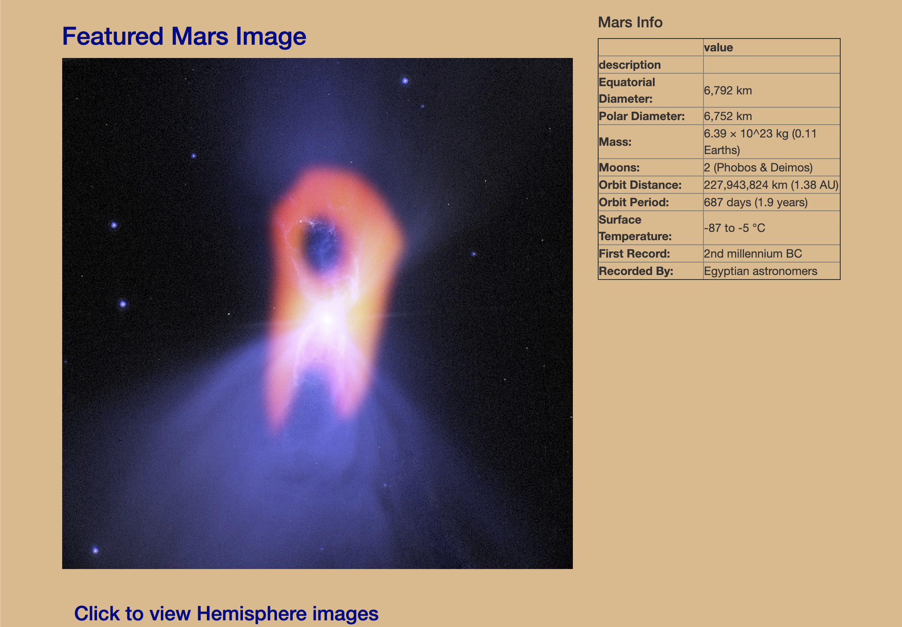
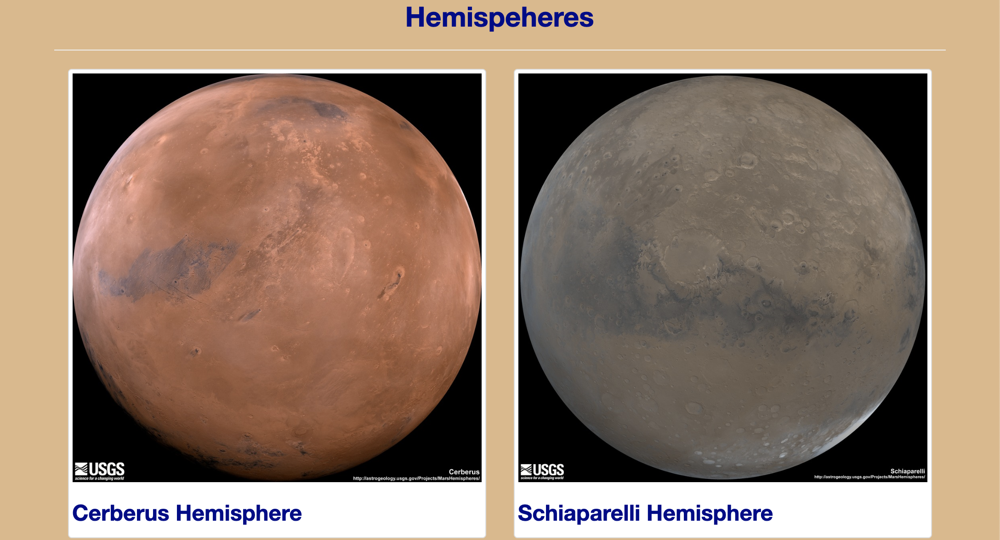
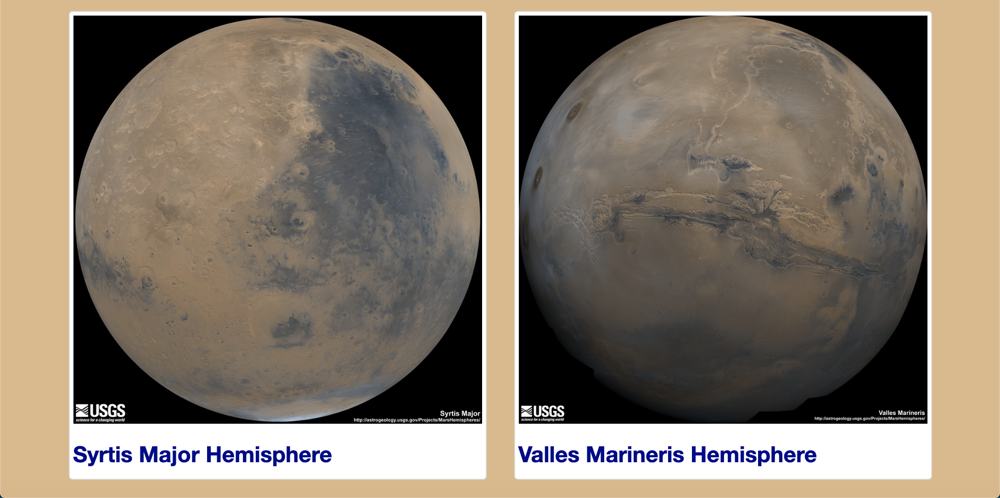

# Mission to Mars

Automate a web browser to visit different websites to extract data about the Mission to Mars. Store it in a NoSQL database, and then render the data in a web application created with Flask.

### Tools

* Use HTML elements, as well as class and id attributes, to identify content for web scraping.
* BeautifulSoup and Splinter to automate a web browser and perform a web scrape.
* Create a MongoDB database to store data from the web scrape.
* Create a web application with Flask to display the data from the web scrape.
* Create an HTML/CSS portfolio to showcase projects.
* Use Bootstrap components to polish and customize the portfolio

